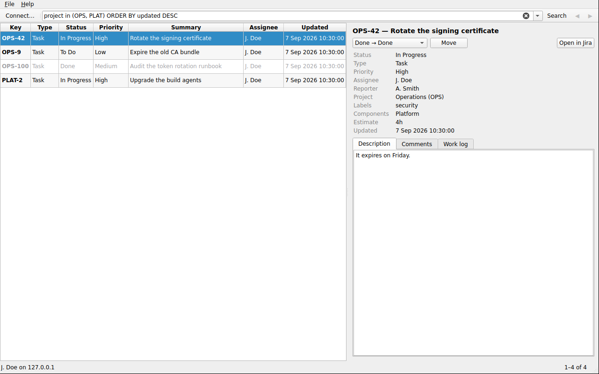

# JiraDesk

A Qt 6 desktop client for Jira, speaking the **REST API v2** over an API token.
Point it at whatever address your Jira lives at — Server, Data Center or Cloud,
under a context path or not — search with JQL, and work the issue without
opening a browser.



## Why v2

API v2 is the version Jira Server and Data Center actually serve, and its issue
descriptions and comments are plain text. Cloud's v3 wraps the same fields in
Atlassian Document Format, which is a JSON tree a desktop client has to render
itself. v2 is available on Cloud too, so one code path covers every instance.

## What it does

- **Search** with JQL, paged, with a remembered query history and a few
  starting points for people who do not write JQL from memory
- **Browse** results in a sortable table — key, type, status, priority,
  summary, assignee, last update
- **Read** the selected issue: fields, description, comments, work log
- **Comment** on an issue
- **Log work** — a duration in Jira's own grammar (`1d 4h`, `90m`), a start
  time, and an optional note
- **Move** an issue through its workflow, using the transitions the server says
  are available to you
- **Open in Jira** for anything the client does not cover

## Authentication

Both kinds of "API token" are supported; pick the matching Jira type in the
connection dialog.

| Jira | Token | Sent as |
| --- | --- | --- |
| Server / Data Center 8.14+ | **Profile → Personal Access Tokens → Create token** | `Authorization: Bearer <token>` |
| Cloud | [id.atlassian.com/manage-profile/security/api-tokens](https://id.atlassian.com/manage-profile/security/api-tokens) | `Authorization: Basic base64(email:token)` |

On an older Server, choose the Cloud mode and use your user name and password —
the header shape is the same.

**Test connection** in the dialog calls `/rest/api/2/myself` and shows you who
Jira thinks you are, so a wrong URL or a wrong token fails there rather than
somewhere less obvious later.

### Where the token lives

By default it is kept in memory only, for the session. Ticking *Remember the
token on this computer* writes it to the application's `QSettings` file, in
plain text — the dialog says so. On a shared machine, leave it off and pass the
token in the environment instead:

```bash
export JIRA_BASE_URL=https://jira.example.com
export JIRA_API_TOKEN=...          # never written to disk
export JIRA_AUTH_MODE=bearer       # or "basic" for Cloud
export JIRA_EMAIL=you@example.com  # Cloud only (JIRA_USER also works)
```

The environment wins over anything stored. **File → Forget stored token**
removes a remembered one.

## Self-hosted instances

Two things that catch out a client pointed at an internal Jira, both handled:

- **A context path.** If Jira is served from `https://intranet.example.com/jira`,
  enter that whole address. The path is preserved on every REST call —
  dropping it turns each request into a 404 from the front-end web server.
- **An internal certificate authority.** Point *CA certificate* at your CA's PEM
  file and TLS verification keeps working. *Accept any certificate* is there for
  when you have nothing else, and disables verification entirely — the last
  resort, not the first.

The system proxy configuration is used, so a corporate proxy needs no setup here.

## Building

Needs Qt 6.2 or newer (Core, Gui, Widgets, Network, and Test for the tests) and
a C++17 compiler.

```bash
# Debian / Ubuntu
sudo apt install qt6-base-dev qt6-base-dev-tools cmake g++

cmake -S . -B build -DCMAKE_BUILD_TYPE=Release
cmake --build build -j"$(nproc)"
./build/jiradesk
```

On macOS `brew install qt cmake`, on Windows use the Qt online installer and
pass `-DCMAKE_PREFIX_PATH=<qt>/msvc2019_64` to the configure step.

### Running it

```bash
jiradesk                                   # opens the connection dialog on first run
jiradesk --jql "project = OPS AND status = 'In Progress'"
jiradesk --help
```

## Tests

```bash
ctest --test-dir build --output-on-failure
```

40 cases over the parts that are painful to debug against a live server: base
URL normalisation and context paths, REST endpoint construction, both
authorization headers, Jira's `+0000` timestamp format in both directions,
duration parsing, the shape of every payload the client reads (including issues
with the nulls Jira sends for unassigned fields), and the error bodies. No
network and no credentials — nothing here talks to a Jira.

## Layout

```
src/
  main.cpp                  application set-up, --jql
  core/                     no UI, no widgets — this is what the tests cover
    credentials.{h,cpp}     auth modes, URL normalisation, QSettings + environment
    jiraclient.{h,cpp}      async REST v2 calls, one Reply object per request
    jiratypes.{h,cpp}       payload structs and their JSON parsing
  ui/
    mainwindow.{h,cpp}      JQL bar, paged results, status bar
    connectiondialog.{h,cpp}  server, auth mode, token, TLS, test connection
    issuetablemodel.{h,cpp}   QAbstractTableModel over a page of results
    issuedetailwidget.{h,cpp} fields, description, comments, work log, transitions
    logworkdialog.{h,cpp}     one worklog entry
tests/
  tst_jiracore.cpp          the core library, offline
```

Every request returns a `jira::Reply` that emits exactly one of
`succeeded`/`failed` and then deletes itself, so a call site is a lambda rather
than another pair of signals on the client.

## Endpoints used

`GET /myself` · `POST /search` · `GET /issue/{key}` ·
`GET,POST /issue/{key}/comment` · `GET,POST /issue/{key}/worklog` ·
`GET,POST /issue/{key}/transitions` · `GET /project`

Search is a POST rather than a GET because JQL routinely outgrows what a proxy
will accept in a query string.

## Known limits

- **Descriptions and comments are shown as plain text.** v2 returns Jira wiki
  markup; rendering it faithfully means a wiki parser, and showing the raw
  markup beats mangling it.
- **No issue creation or field editing.** Reading, commenting, logging work and
  transitioning are covered; anything else is a trip to the browser.
- **A transition needing a screen field will fail**, with Jira's own message
  naming the field. Do those in the browser.
- **Attachments are not listed or downloaded.**
- **The stored token is not encrypted.** It is a `QSettings` value; use the
  environment variable on a machine you share.
