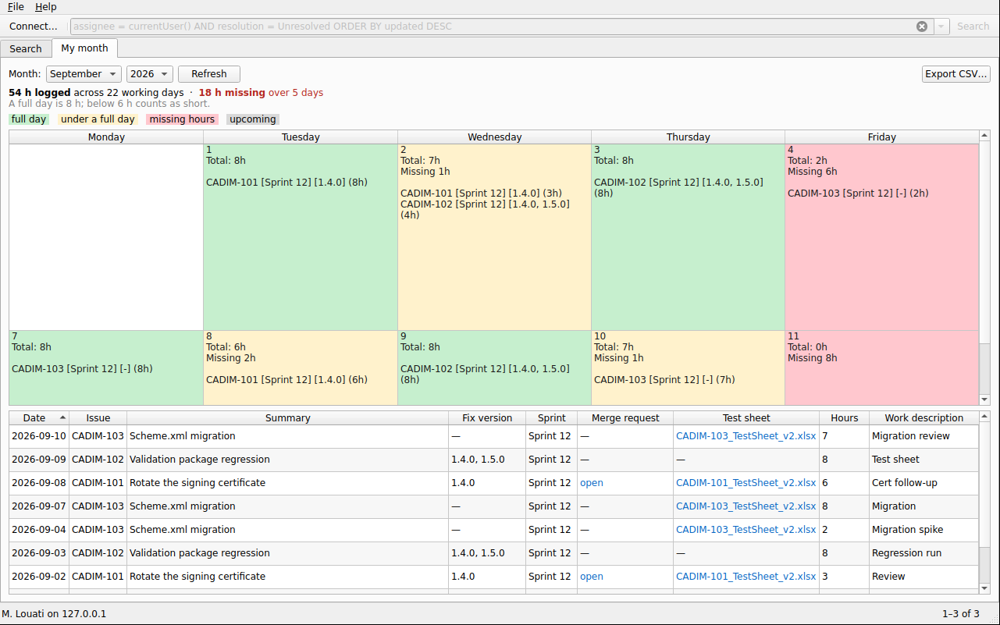
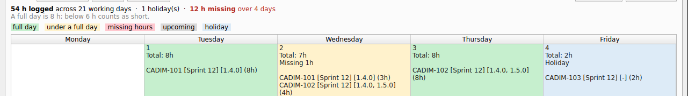
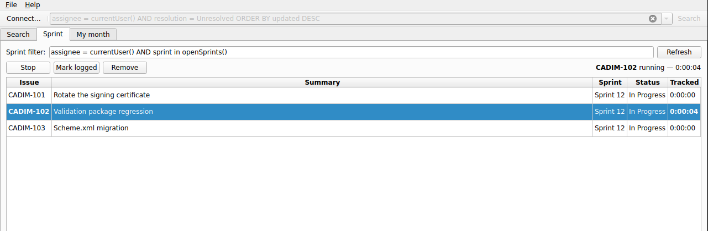

# JiraDesk

A Qt desktop client for Jira, speaking the **REST API v2** over an API token.
Builds against Qt 6 or Qt 5.15.
Point it at whatever address your Jira lives at — Server, Data Center or Cloud,
under a context path or not — search with JQL, and work the issue without
opening a browser.



*The month view: a short day is coloured and says how much is missing, so nothing has to be added up by hand.*



*Marking the 4th a holiday: it turns blue, stops owing its 6 h, and the month drops from 18 h missing over 5 days to 12 h over 4.*

## Why v2

API v2 is the version Jira Server and Data Center actually serve, and its issue
descriptions and comments are plain text. Cloud's v3 wraps the same fields in
Atlassian Document Format, which is a JSON tree a desktop client has to render
itself. v2 is available on Cloud too, so one code path covers every instance.

## What it does

Three screens.

**My month** answers *"which days am I still short on?"* — the job the
`jira2.py` Excel report was doing:

- a Mon-Fri calendar of the month, one cell per day, showing the day's total
  and every issue booked against it
- **green** at or above a full day, **amber** below it, **red** when hours are
  missing, **grey** for days that have not happened yet, **blue** for a holiday
- **right-click a day to mark it a holiday** — leave, a public holiday, a day
  off. A holiday owes nothing however empty it is, drops out of the working-day
  count, and is excluded from the month's missing total. Right-click again to
  make it a working day. Holidays are kept on this machine, since Jira has no
  idea when you are off, and carry through to the Excel export
- each short day says how much is missing, and the header totals it for the
  month
- a flat work-log table underneath: date, issue, summary, **hours**, **sprint**,
  **fix version**, **merge request**, **test sheet**, **specifications** and the
  work description. The merge request and test sheet open in the browser, and
  double-clicking an issue key jumps to it
- a fix version of the form **P** followed by digits (`P221997`) names a
  specification rather than a release, so it is reported in its own column and
  kept out of the fix version one
- **Export Excel** writes the two-sheet workbook — a flat `Worklogs` sheet with
  working hyperlinks, and the colour-banded `Calendar` sheet — or **Export CSV**
  for the rows alone

**Sprint** is the task list and its stopwatch:



- the issues in your open sprint that Jira still assigns to **you**
- **Start**/**Stop** a timer on the selected task. Exactly one runs at a time —
  starting another banks the first one's time and takes over.
- tracked time is **local only**. Nothing is ever written to Jira: log the real
  figure yourself, then **Mark logged** clears the stopwatch and puts the
  figure (`1h 05m`) on the clipboard to paste in.
- a task drops off the list when Jira stops assigning it to you — that is what
  makes it done. The exception is a task still holding tracked time or being
  timed right now: that one stays, flagged *no longer yours*, so an hour of
  timing is not thrown away by somebody else's reassignment. **Remove** clears
  it once you are finished.
- the filter is editable, because `openSprints()` needs Jira Software. Without
  it, something like `assignee = currentUser() AND resolution = Unresolved`
  works.

**Search** is the general issue browser:

- **Search** with JQL, paged, with a remembered query history and a few
  starting points for people who do not write JQL from memory
- **Browse** results in a sortable table — key, type, status, priority,
  summary, assignee, last update
- **Read** the selected issue: fields, description, comments, work log
- **Comment** on an issue
- **Log work** — a duration in Jira's own grammar (`1d 4h`, `90m`), a start
  time, and an optional note
- **Move** an issue through its workflow, using the transitions the server says
  are available to you
- **Open in Jira** for anything the client does not cover

## Per-instance conventions

Four of the columns depend on how your Jira is set up, so they are configurable
under **File → Timesheet settings** rather than hard-coded:

| Setting | Default | What it decides |
| --- | --- | --- |
| Sprint field | `customfield_10005` | Which custom field holds the sprint. Leave it empty and every `customfield_*` is scanned for something sprint-shaped instead. |
| Test sheet marker | `testsheet` | An attachment is the test sheet when its file name contains this, ignoring case. |
| Merge request marker | `/merge_requests/` | A remote link is the merge request when its URL contains this. Use `/pull/` for GitHub; empty skips the lookup and loads the month faster. |
| A full day is | `8 h` | The green threshold, and what a short day is measured against. |
| Amber at or above | `6 h` | Between this and a full day the cell is amber rather than red. |

Sprint values are read in both shapes Jira uses: the Java `toString()` that
Server returns (`...,name=Sprint 12,...`) and the plain object newer instances
return.

## Authentication

Both kinds of "API token" are supported; pick the matching Jira type in the
connection dialog.

| Jira | Token | Sent as |
| --- | --- | --- |
| Server / Data Center 8.14+ | **Profile → Personal Access Tokens → Create token** | `Authorization: Bearer <token>` |
| Cloud | [id.atlassian.com/manage-profile/security/api-tokens](https://id.atlassian.com/manage-profile/security/api-tokens) | `Authorization: Basic base64(email:token)` |
| Any Jira, no token | your own user name and password | `Authorization: Basic base64(user:password)` |

The two modes are labelled by the header they send, not by the hosting, because
a self-hosted server accepts plain Basic with a user name and password just as
Cloud accepts Basic with an e-mail and a token.

**Test connection** in the dialog calls `/rest/api/2/myself` and shows you who
Jira thinks you are, so a wrong URL or a wrong token fails there rather than
somewhere less obvious later.

### Where the token lives

By default it is kept in memory only, for the session. Ticking *Remember the
token on this computer* writes it to the application's `QSettings` file, in
plain text — the dialog says so. On a shared machine, leave it off and pass the
token in the environment instead:

```bash
export JIRA_BASE_URL=https://jira.example.com
export JIRA_API_TOKEN=...          # never written to disk
export JIRA_AUTH_MODE=bearer       # or "basic" for Cloud
export JIRA_EMAIL=you@example.com  # Cloud only (JIRA_USER also works)
```

The environment wins over anything stored. **File → Forget stored token**
removes a remembered one.

## Self-hosted instances

Two things that catch out a client pointed at an internal Jira, both handled:

- **A context path.** If Jira is served from `https://intranet.example.com/jira`,
  enter that whole address. The path is preserved on every REST call —
  dropping it turns each request into a 404 from the front-end web server.
- **An internal certificate authority.** Point *CA certificate* at your CA's PEM
  file and TLS verification keeps working. *Accept any certificate* is there for
  when you have nothing else, and disables verification entirely — the last
  resort, not the first.

The system proxy configuration is used, so a corporate proxy needs no setup here.

## Building

Builds against **Qt 6.2 or newer, or Qt 5.15** (Core, Gui, Widgets, Network,
and Test for the tests), with a C++17 compiler. Both are built in CI.

```bash
# Debian / Ubuntu -- Qt 6
sudo apt install qt6-base-dev qt6-base-dev-tools cmake g++
# ...or Qt 5
sudo apt install qtbase5-dev qtbase5-dev-tools cmake g++

cmake -S . -B build -DCMAKE_BUILD_TYPE=Release
cmake --build build -j"$(nproc)"
./build/jiradesk
```

With both installed, Qt 6 wins. Pin the other explicitly:

```bash
cmake -S . -B build -DJIRADESK_QT_VERSION=5    # or 6, or Auto (the default)
```

Qt 5.15 is the floor rather than an older 5.x because
`QNetworkRequest::setTransferTimeout` arrived there, and a request with no
timeout can hang the window indefinitely. The forms open in either version's
Qt Designer.

On macOS `brew install qt cmake`, on Windows use the Qt online installer and
pass `-DCMAKE_PREFIX_PATH=<qt>/msvc2019_64` to the configure step.

### Running it

```bash
jiradesk                                   # opens the connection dialog on first run
jiradesk --jql "project = OPS AND status = 'In Progress'"
jiradesk --help
```

## Tests

```bash
ctest --test-dir build --output-on-failure
```

62 cases over the parts that are painful to debug against a live server: base
URL normalisation and context paths, REST endpoint construction, both
authorization headers, Jira's `+0000` timestamp format in both directions,
duration parsing, the shape of every payload the client reads (including issues
with the nulls Jira sends for unassigned fields), and the error bodies.

Also sprint parsing in both of Jira's shapes, test-sheet and merge-request
matching, and the day banding — that a day with nothing logged still appears,
that a day in the future is never "missing", and that an over-full day does not
offset a short one. And the workbook writer, which produces a real file whose
container and XML escaping are then checked, and the task tracker: one timer at
a time, and the rules for dropping a task that is no longer yours.

Holidays too: that a marked day owes nothing however empty it is, that marking
one changes the month total by exactly what that day owed, that a holiday on a
weekend is not counted as time off, and that the marks survive a reload.

Also the P-numbered fix versions, and the CSV: that it carries a UTF-8 byte
order mark, puts the columns in the documented order, leaves the hours
unquoted, and doubles an embedded quote instead of breaking the field.

No network and no credentials — nothing here talks to a Jira.

## Layout

All seven screens are Qt Designer forms: each `src/ui/*.ui` opens in Designer,
and AUTOUIC turns it into a `ui_*.h` the matching `.cpp` includes. Layout,
labels, tooltips and shortcuts are edited in Designer; the `.cpp` files hold
behaviour only.

Three widgets — `IssueDetailWidget`, `SprintWidget` and `TimesheetWidget` — are
promoted inside `mainwindow.ui`, so each takes only a parent in its constructor
and receives the Jira client afterwards through `setClient()`. That is what lets
Designer instantiate them.

```
src/
  main.cpp                  application set-up, --jql
  core/                     no UI, no widgets — this is what the tests cover
    credentials.{h,cpp}     auth modes, URL normalisation, QSettings + environment
    jiraclient.{h,cpp}      async REST v2 calls, one Reply object per request
    jiratypes.{h,cpp}       payload structs and their JSON parsing
    timesheet.{h,cpp}       grouping worklogs by day, and the short-day bands
    timesheetloader.{h,cpp} the month pipeline, with bounded requests in flight
    timesheetexport.{h,cpp} the two-sheet workbook
    tasktracker.{h,cpp}     the sprint task list and its local stopwatch
    xlsxwriter.{h,cpp}      a small .xlsx writer -- see below
  ui/
    mainwindow.{h,cpp}      JQL bar, paged results, status bar
    connectiondialog.{h,cpp}  server, auth mode, token, TLS, test connection
    issuetablemodel.{h,cpp}   QAbstractTableModel over a page of results
    issuedetailwidget.{h,cpp} fields, description, comments, work log, transitions
    logworkdialog.{h,cpp}     one worklog entry
    sprintwidget.{h,cpp}      the sprint task list and timer
    timesheetwidget.{h,cpp}   the month calendar and work-log table
    timesheetsettingsdialog.{h,cpp}  the per-instance conventions above
tests/
  tst_jiracore.cpp          the core library, offline
```

Every request returns a `jira::Reply` that emits exactly one of
`succeeded`/`failed` and then deletes itself, so a call site is a lambda rather
than another pair of signals on the client.

## The .xlsx writer

No spreadsheet library is used. An `.xlsx` is a ZIP of XML parts, so
`xlsxwriter` writes the handful Excel insists on — content types, workbook,
styles, a worksheet per sheet, and external hyperlink relationships — and stores
them uncompressed. A month of worklogs is a few tens of kilobytes, so the
arithmetic stays simple enough to check by eye instead of pulling in a
compression dependency.

It covers only what these two sheets need: text and numeric cells, nine fixed
styles, column widths, row heights and external hyperlinks. It is not a general
spreadsheet writer and is not meant to become one.

## Endpoints used

`GET /myself` · `POST /search` · `GET /issue/{key}` ·
`GET,POST /issue/{key}/comment` · `GET,POST /issue/{key}/worklog` ·
`GET,POST /issue/{key}/transitions` · `GET /issue/{key}/remotelink` ·
`GET /project`

The month view asks the one search for `fixVersions`, `attachment` and the
sprint field together, so those cost no extra request; only the work log and the
remote links need a call per issue, and at most six are ever in flight.

Search is a POST rather than a GET because JQL routinely outgrows what a proxy
will accept in a query string.

## Text encoding

Every source file is UTF-8 without a byte order mark, which MSVC otherwise
reads as the system ANSI code page — an em dash then renders as `â€"`. The
build passes `/utf-8` on MSVC, which fixes the sources and the uic-generated
headers alike. The "nothing here" placeholders are additionally built from
their code point rather than typed in, so they survive even a build that misses
the flag.

The CSV export begins with a UTF-8 BOM for the same reason: without it Excel
reads the file as the system code page.

## Known limits

- **Descriptions and comments are shown as plain text.** v2 returns Jira wiki
  markup; rendering it faithfully means a wiki parser, and showing the raw
  markup beats mangling it.
- **No issue creation or field editing.** Reading, commenting, logging work and
  transitioning are covered; anything else is a trip to the browser.
- **No "specifications" column.** Fix version, sprint, merge request and test
  sheet are there; if specifications live in an attachment or a link too, it is
  a marker away.
- **Tracked time never reaches Jira.** That is deliberate: the stopwatch is a
  reminder, and the real worklog is written by hand.
- **A timer does not survive quitting.** Its time is banked on exit; it does not
  resume on the next launch, because counting the hours the machine was off
  would book a whole night against a task.
- **Weekends are ignored**, and every working day is assumed to be a full day.
  Holidays are marked by hand, one day at a time: nothing is imported from a
  public-holiday calendar and there is no part-time or half-day allowance.
- **A transition needing a screen field will fail**, with Jira's own message
  naming the field. Do those in the browser.
- **Attachments are not listed or downloaded.**
- **The stored token is not encrypted.** It is a `QSettings` value; use the
  environment variable on a machine you share.
